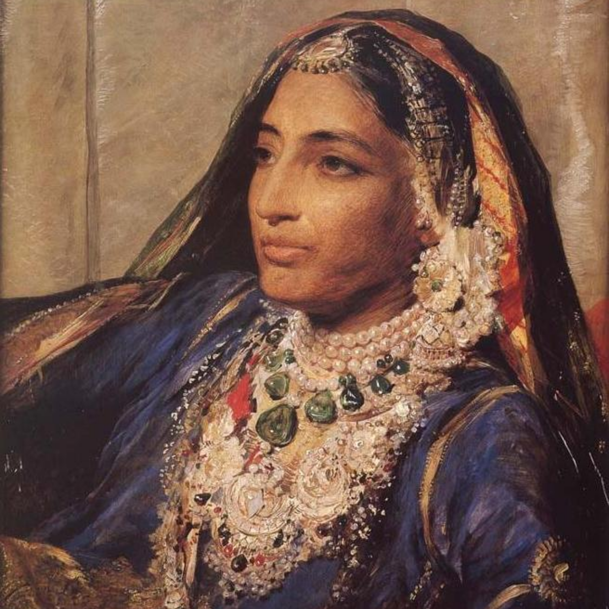

# Jind

Jind is a simple and lightweight stop motion animation program written in Rust using Tauri and Yew. It is named after Maharani Jind Kaur, the last Queen of Panjaab. 

### todo
- add delay to frame capture  
- polish and fix ui 
- .jind file association 
- builds for Android, IOS, Windows, MacOS